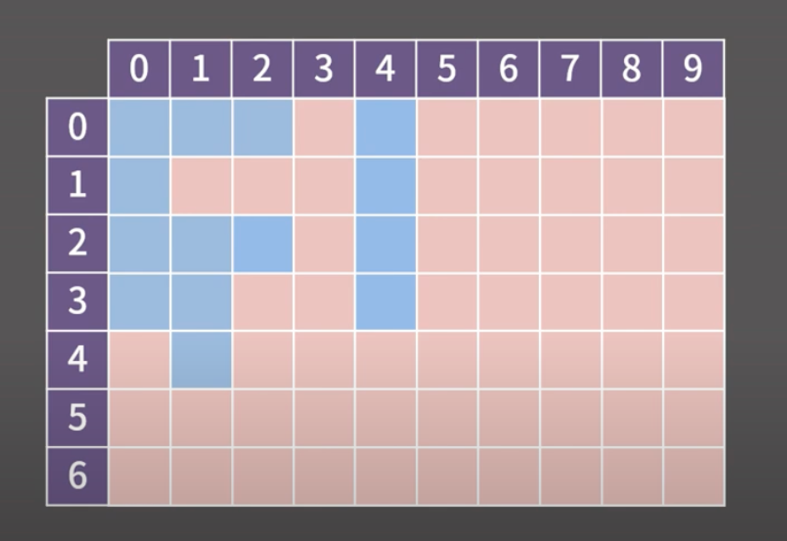

# BFS (Breadth First Search)

- 다차원 배열에서 각 칸을 방문할 때 너비를 우선으로 방문하는 알고리즘
- 그래프 자료구조에서 모든 노드를 방문하기 위한 알고리즘
    - 여기서 그래프란, 정점과 간선으로 이루어진 자료구조를 의미한다.

## BFS 과정

아래 2차원 배열에서 모든 파란 칸을 확인한다고 가정하자.



1. 우선 BFS 알고리즘에서는 좌표를 담을 큐가 필요하다.
2. BFS가 시작되면, 우선 출발점인 (0, 0)에 방문했다는 표시를 남기고 해당 칸을 큐에 넣는다.
3. 이후, 해당 칸을 기준으로 상하좌우 살펴주면서 큐에 넣는 작업을 반복한다.
    1. 이 때, 파란색 칸이면서 아직 방문하지 않은 칸을 찾는다.
    2. 찾았다면, 방문했다는 표시를 남기고 큐에 해당 좌표를 넣는다.
4. 큐가 비었다면 탐색을 종료한다.

## 시간 복잡도

- 모든 칸이 큐에 1번씩 들어가므로 시간 복잡도는 칸이 N개일 때 `O(N)`
- 방문 표시를 남기기 때문에 모든 칸은 큐에 한번씩만 들어가게 된다.
- 만약 행이 R개이고 열이 C개이면 `O(RC)`

## 코드

```java
// 상하좌우
static final int[] MOVE_X = {-1, 1, 0, 0};
static final int[] MOVE_Y = {0, 0, -1, 0};

Queue<int[]> q = new LinkedList<>();
boolean[][] visited = new boolean[n][n];

// 시작점 삽입
q.offer(new int[] {0, 0});
visited[0][0] = true;

// 상하좌우 탐색
while (!q.isEmpty()) {
	int[] curr = q.poll();
	
	for (int i = 0; i < 4; i++) {
		int nx = curr[0] + MOVE_X[i];
		int ny = curr[1] + MOVE_Y[i];
		
		if (nx < 0 || nx >= n || ny < 0 || ny >= n) continue;
		if (!visited[nx][ny]) {
			q.offer(new int[] {nx, ny});
			visited[nx][ny] = true;
		}
	}
}
```

## 실수할만 한 것

1. 시작점을 큐에 넣긴 하는데 정작 방문했다는 표시를 남기지 않은 경우
    1. 이 경우 시작점을 2번 방문할 우려가 있다.
2. 큐에 넣을 때 방문했다는 표시를 하는 대신 **큐에서 빼낼 때 방문했다는 표시를 남기는 경우**
    1. 이 경우 같은 칸이 큐에 여러번 들어가게 되어 시간 초과나 메모리 초과가 날 수 있다.
3. 이웃한 원소가 범위를 벗어났는지에 대한 체크를 잘못한 경우
    1. 앞에 코드에 있던 nx, ny가 배열 바깥으로 벗어났는지에 대한 루틴을 빼먹었거나, 이상하게 구현한 상황

## BOJ 1926: 그림

```java
import java.io.*;
import java.util.*;

public class Main {
    
    static final int[] MOVE_X = {-1, 1, 0, 0};
    static final int[] MOVE_Y = {0, 0, -1, 1};
    static int n, m;
    static int max = 0;  // 그림이 하나도 없는 경우 가장 넓은 그림의 넓이는 0
    static boolean[][] visited;
    static int[][] board;
    
    public static void main(String args[]) throws Exception {
        BufferedReader br = new BufferedReader(new InputStreamReader(System.in));
        
        String[] input = br.readLine().split(" ");
        n = Integer.parseInt(input[0]);
        m = Integer.parseInt(input[1]);
        
        board = new int[n][m];
        
        for (int i = 0; i < n; i++) {
            input = br.readLine().split(" ");
            for (int j = 0; j < m; j++) {
                board[i][j] = Integer.parseInt(input[j]);
            }
        }
        
        int paintCount = 0;
        visited = new boolean[n][m];
        for (int i = 0; i < n; i++) {
            for (int j = 0; j < m; j++) {
                if (board[i][j] == 1 && !visited[i][j]) {
                    bfs(i, j);
                    paintCount++;
                }
            }
        }
        
        System.out.println(paintCount);
        System.out.println(max);
    }
    
    private static void bfs(int x, int y) {
        Queue<int[]> q = new LinkedList<>();
        
        q.offer(new int[] {x, y});
        visited[x][y] = true;
        int area = 1;
        
        while (!q.isEmpty()) {
            int[] curr = q.poll();
            
            for (int i = 0; i < 4; i++) {
                int nx = curr[0] + MOVE_X[i];
                int ny = curr[1] + MOVE_Y[i];
                
                if (nx < 0 || nx >= n || ny < 0 || ny >= m) continue;
                
                if (!visited[nx][ny] && board[nx][ny] == 1) {
                    q.offer(new int[] {nx, ny});
                    visited[nx][ny] = true;
                    area++;
                }
            }
        }
        
        max = Math.max(area, max);
    }
}
```

## BOJ 2178: 미로 탐색- 거리 측정

```java
import java.io.*;
import java.util.*;

public class Main {
    
    static final int[] MOVE_X = {-1, 1, 0, 0};
    static final int[] MOVE_Y = {0, 0, -1, 1};
    static int n, m;
    static int[][] board;
    
    public static void main(String args[]) throws Exception {
        BufferedReader br = new BufferedReader(new InputStreamReader(System.in));
        
        String[] input = br.readLine().split(" ");
        n = Integer.parseInt(input[0]);
        m = Integer.parseInt(input[1]);
        
        board = new int[n][m];
        
        for (int i = 0; i < n; i++) {
            input = br.readLine().split("");
            for (int j = 0; j < m; j++) {
                board[i][j] = Integer.parseInt(input[j]);
            }
        }
        
        bfs(0, 0);
    }
    
    private static void bfs(int x, int y) {
        Queue<int[]> q = new LinkedList<>();
        boolean[][] visited = new boolean[n][m];
        
        q.offer(new int[] {x, y, 1});     // 현재 위치와 현재 위치일 때의 이동한 칸의 수
        visited[x][y] = true;
        
        while (!q.isEmpty()) {
            int[] curr = q.poll();
            
            if (curr[0] == n - 1 && curr[1] == m - 1) {
                System.out.println(curr[2]);
                break;
            }
            
            for (int i = 0; i < 4; i++) {
                int nx = curr[0] + MOVE_X[i];
                int ny = curr[1] + MOVE_Y[i];
                
                if (nx < 0 || nx >= n || ny < 0 || ny >= m) continue;
                
                if (!visited[nx][ny] && board[nx][ny] == 1) {
                    q.offer(new int[] {nx, ny, curr[2] + 1});
                    visited[nx][ny] = true;
                }
            }
        }
    }
}
```

```java
import java.util.*;
import java.io.*;

public class Main {
    
    // 상하좌우로 움직이기 위한 상수
    static final int[] MOVE_X = { -1, 1, 0, 0 };
    static final int[] MOVE_Y = { 0, 0, -1, 1 };
    static int n, m;
    static int[][] board;
    
    public static void main(String args[]) throws Exception {
        BufferedReader br = new BufferedReader(new InputStreamReader(System.in));
        
        String[] input = br.readLine().split(" ");
        
        n = Integer.parseInt(input[0]);
        m = Integer.parseInt(input[1]);
        
        board = new int[n][m];
        
        for (int i = 0; i < n; i++) {
            input = br.readLine().split("");
            for (int j = 0; j < m; j++) {
                board[i][j] = Integer.parseInt(input[j]);
            }
        }
        
        System.out.println(bfs());
    }
    
    private static int bfs() {
        Queue<int[]> q = new LinkedList<>();
        
        // 출발 지점 insert
        q.offer(new int[] {0, 0});
        
        while (!q.isEmpty()) {
            int[] curr = q.poll();
            
            // 상하좌우 탐색
            for (int i = 0; i < 4; i++) {
                int nx = curr[0] + MOVE_X[i];
                int ny = curr[1] + MOVE_Y[i];
                
                if (nx < 0 || nx >= n || ny < 0 || ny >= m) continue;
                
                if (board[nx][ny] == 1) {
                    q.offer(new int[] {nx, ny});
                    board[nx][ny] = board[curr[0]][curr[1]] + 1;
                }
            }
        }
        
        return board[n - 1][m - 1];
    }
}
```

- 다차원 배열에서의 거리 측정 문제
- 미로의 좌측 상단으로부터 우측 하단으로 가는 최단 경로의 길이를 찾는 문제
- BFS를 이용해 **시작점에서 연결된 다른 모든 점으로의 최단 경로를 찾을 수 있다.**

## BOJ 7576: 토마토 - 시작점이 여러개일 때

```java
import java.io.*;
import java.util.*;

public class Main {
    
    static final int[] MOVE_X = {-1, 1, 0, 0};
    static final int[] MOVE_Y = {0, 0, -1, 1};
    static int n, m;
    static int[][] board;
    
    public static void main(String args[]) throws Exception {
        BufferedReader br = new BufferedReader(new InputStreamReader(System.in));
        
        String[] input = br.readLine().split(" ");
        n = Integer.parseInt(input[1]);
        m = Integer.parseInt(input[0]);
        
        board = new int[n][m];
        Queue<int[]> q = new LinkedList<>();
        
        for (int i = 0; i < n; i++) {
            input = br.readLine().split(" ");
            for (int j = 0; j < m; j++) {
                board[i][j] = Integer.parseInt(input[j]);
                if (board[i][j] == 1) {
                    q.offer(new int[] {i, j, 0});
                }
            }
        }
        
        if (isAll()) System.out.println(0);
        else bfs(q);
    }
    
    private static void bfs(Queue<int[]> q) {
        int max = -1;
        
        while (!q.isEmpty()) {
            int[] curr = q.poll();
            
            for (int i = 0; i < 4; i++) {
                int nx = curr[0] + MOVE_X[i];
                int ny = curr[1] + MOVE_Y[i];
                
                if (nx < 0 || nx >= n || ny < 0 || ny >= m) continue;
                
                if (board[nx][ny] == 0) {
                    q.offer(new int[] {nx, ny, curr[2] + 1});
                    board[nx][ny] = 1;
                    
                    max = Math.max(max, curr[2] + 1);
                }
            }
        }
        
        // 모든 토마토가 익었는지 확인
        if (!isAll()) max = -1;
        
        System.out.println(max);
    }
    
    private static boolean isAll() {
        for (int i = 0; i < n; i++) {
            for (int j = 0; j < m; j++) {
                if (board[i][j] == 0) {
                    return false;
                }
            }
        }
        
        return true;
    }
}
```

```java
import java.io.*;
import java.util.*;

class Tomato {
    int x;
    int y;
    int day;
    
    public Tomato(int x, int y, int day) {
        this.x = x;
        this.y = y;
        this.day = day;
    }
}

public class Main {
    
    static final int[] MOVE_X = { -1, 1, 0, 0 };
    static final int[] MOVE_Y = { 0, 0, -1, 1 };
    
    static int n, m;
    static int min = Integer.MAX_VALUE;
    static int result = 0;
    
    // 해당 문제를 BFS로 풀어야 하는 이유: 1인 경우 사방에 전파되기 때문!
    // 출발지를 따로 설정할 필요도 없음. 익은 토마토가 있으면 어찌되었든 전파되기 때문
    
    public static void main(String args[]) throws Exception {
        BufferedReader br = new BufferedReader(new InputStreamReader(System.in));
        
        String[] input = br.readLine().split(" ");
        m = Integer.parseInt(input[0]);
        n = Integer.parseInt(input[1]);
        
        int[][] box = new int[n][m];
        Queue<Tomato> q = new LinkedList<>();
        
        for (int i = 0; i < n; i++) {
            input = br.readLine().split(" ");
            for (int j = 0; j < m; j++) {
                box[i][j] = Integer.parseInt(input[j]);
                if (box[i][j] == 1) {
                    q.add(new Tomato(i, j, 0));
                }
            }
        }
        
        // 1. 모든 토마토가 익은 경우 정답 출력 / 아니라면 탐색 시작
        if (isAllRipened(box)) {
            System.out.println(0);
        } else {
            int day = -1;
            
            while (!q.isEmpty()) {
                Tomato t = q.poll();
                day = t.day;   // 큐가 다 비워질 때 쯤이 최종 날짜
                
                for (int i = 0; i < 4; i++) {
                    int nx = t.x + MOVE_X[i];
                    int ny = t.y + MOVE_Y[i];

                    if (nx < 0 || nx >= n || ny < 0 || ny >= m) continue;
                    
                    if (box[nx][ny] == 0) {
                        box[nx][ny] = 1;
                        q.add(new Tomato(nx, ny, t.day + 1));
                    }
                }
            }
            
            if (isAllRipened(box)) {
                System.out.println(day);
            } else {
                System.out.println(-1);
            }
        }
    }
    
    private static boolean isAllRipened(int[][] box) {
        for (int i = 0; i < n; i++) {
            for (int j = 0; j < m; j++) {
                if (box[i][j] == 0) return false;
            }
        }
        
        return true;
    }
}
```

- 출발점이 1개인 경우 미로 탐색처럼 풀면 된다.
- 그러나 익은 토마토가 여러개인 경우, 모든 시작점을 넣고 BFS를 돌리면 된다.
- BOJ 7569: 토마토도 풀어볼 것 - 3차원 배열

## BOJ 4179: 불! - 시작점이 두 종류일 때

```java
import java.io.*;
import java.util.*;

public class Main {
    
    static final int[] MOVE_X = {-1, 1, 0, 0};
    static final int[] MOVE_Y = {0, 0, -1, 1};
    
    public static void main(String args[]) throws Exception {
        BufferedReader br = new BufferedReader(new InputStreamReader(System.in));
        
        String[] input = br.readLine().split(" ");
        
        int r = Integer.parseInt(input[0]);
        int c = Integer.parseInt(input[1]);
        
        String[][] board = new String[r][c];
        
        int[] jihun = new int[2];
        List<int[]> fires = new ArrayList<>();
        
        for (int i = 0; i < r; i++) {
            input = br.readLine().split("");
            for (int j = 0; j < c; j++) {
                board[i][j] = input[j];
                
                if (board[i][j].equals("J")) {
                    jihun[0] = i;
                    jihun[1] = j;
                } else if (board[i][j].equals("F")) {
                    int[] f = new int[2];
                    f[0] = i;
                    f[1] = j;
                    fires.add(f);
                }
            }
        }
        
        int[][] fireTime = new int[r][c];
        for (int i = 0; i < r; i++) {
            for (int j = 0; j < c; j++) {
                fireTime[i][j] = -1;
            }
        }
        
        // 불에 대한 bfs
        Queue<int[]> fq = new LinkedList<>();
        
        for (int[] f : fires) {
            fq.add(f);
            fireTime[f[0]][f[1]] = 0;
        }
        
        while (!fq.isEmpty()) {
            int[] fc = fq.poll();
            
            for (int i = 0; i < 4; i++) {
                int nx = fc[0] + MOVE_X[i];
                int ny = fc[1] + MOVE_Y[i];
                
                if (nx < 0 || nx >= r || ny < 0 || ny >= c) continue;
                if (board[nx][ny].equals("#")) continue;
                
                if (fireTime[nx][ny] == -1) {
                    fireTime[nx][ny] = fireTime[fc[0]][fc[1]] + 1;
                    fq.add(new int[] {nx, ny});
                }
            }
        }
        
        // 지훈에 대한 bfs
        Queue<int[]> jq = new LinkedList<>();
        
        int[][] jihunTime = new int[r][c];
        for (int i = 0; i < r; i++) {
            for (int j = 0; j < c; j++) {
                jihunTime[i][j] = -1;
            }
        }
        
        jq.add(jihun);
        jihunTime[jihun[0]][jihun[1]] = 0;
        
        while (!jq.isEmpty()) {
            int[] jc = jq.poll();
            
            for (int i = 0; i < 4; i++) {
                int nx = jc[0] + MOVE_X[i];
                int ny = jc[1] + MOVE_Y[i];
                
                // 범위를 벗어난 경우 탈출
                if (nx < 0 || nx >= r || ny < 0 || ny >= c) {
                    System.out.println(jihunTime[jc[0]][jc[1]] + 1);
                    return;
                }
                // 벽인 경우 갈 수 없음
                if (board[nx][ny].equals("#")) continue;
                
                // 처음 방문하는 곳인 경우
                if (jihunTime[nx][ny] == -1) {
                    // 불 전파 시간이 내 이동 시간보다 빠르면 갈 수 없음
                    if (fireTime[nx][ny] == -1 || jihunTime[jc[0]][jc[1]] + 1 < fireTime[nx][ny]) {
                        jq.add(new int[] {nx, ny});
                        jihunTime[nx][ny] = jihunTime[jc[0]][jc[1]] + 1;
                    }
                }
            }
        }
        
        System.out.println("IMPOSSIBLE");
    }
}
```

결론적으로 **불에 대한 BFS와 지훈이에 대한 BFS를 따로 처리**해줘야한다.

1. 우선 지훈이는 신경쓰지 말고, BFS를 돌려서 미리 각 칸에 불이 전파되는 시간을 구한다.
2. 그 다음, 지훈이에 대한 BFS를 돌리며 이동시킨다.
    1. 이 때, 지훈이가 특정 칸을 x 시간에 최초로 방문할 수 있는데, 그 칸에 x시간이나 그 이전에 불이 붙으면 그 칸은 갈 수 없다.
3. 이 때, **불은 여러개**이기 때문에 여러 불의 출발점을 큐에 넣어야한다.

만약, 위 예제처럼이 아니라 **서로가 서로의 이동에 영향을 주는 경우**는 어떻게 풀이하는가? (18809 - 백트래킹)

## BOJ 1697: 숨바꼭질 - 1차원에서의 BFS

```java
import java.io.*;
import java.util.*;

public class Main {
    
    static int[] board = new int[100001];
    
    public static void main(String args[]) throws Exception {
        BufferedReader br = new BufferedReader(new InputStreamReader(System.in));
        
        String[] input = br.readLine().split(" ");
        int n = Integer.parseInt(input[0]);
        int k = Integer.parseInt(input[1]);
        
        Arrays.fill(board, -1);
        
        bfs(n, k);
    }
    
    private static void bfs(int n, int k) {
        Queue<Integer> q = new LinkedList<>();
        
        q.add(n);     // 현재 위치
        board[n] = 0;   // 그 때의 시간
        
        while (!q.isEmpty()) {
            int curr = q.poll();
            
            // 도착한 경우
            if (curr == k) {
                System.out.println(board[curr]);
                return;
            }
            
            // 범위를 벗어나지 않았고 방문하지 않은 경우
            if (curr - 1 >= 0 && board[curr - 1] == -1) {
                q.add(curr - 1);
                board[curr - 1] = board[curr] + 1;
            }
            
            // 범위를 벗어나지 않았고 방문하지 않은 경우
            if (curr + 1 <= 100000 && board[curr + 1] == -1) {
                q.add(curr + 1);
                board[curr + 1] = board[curr] + 1;
            }
            
            // 범위를 벗어나지 않았고 방문하지 않은 경우
            if (curr * 2 <= 100000 && board[curr * 2] == -1) {
                q.add(curr * 2);
                board[curr * 2] = board[curr] + 1;
            }
        }
    }
}
```

- 범위의 경우, 수빈이와 동생의 위치가 0에서 10만 사이라고 했지 수빈이가 이동중에 반드시 0에서 10만 사이에만 있어야한다는 조건은 없다.
    - 따라서 범위를 고려하는 것이 좋다.
    - 사실 10만을 탈출하는 것은 손해이다.