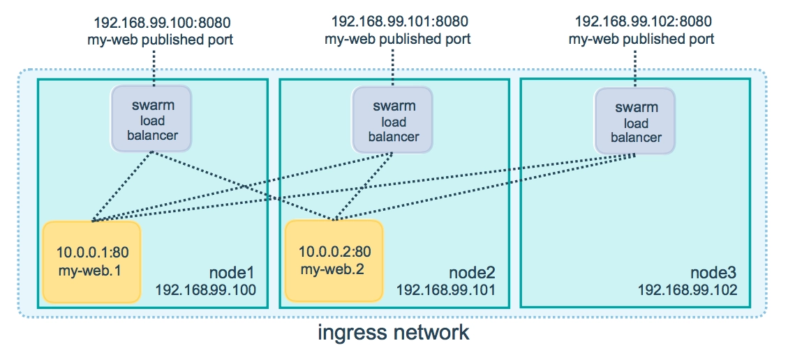
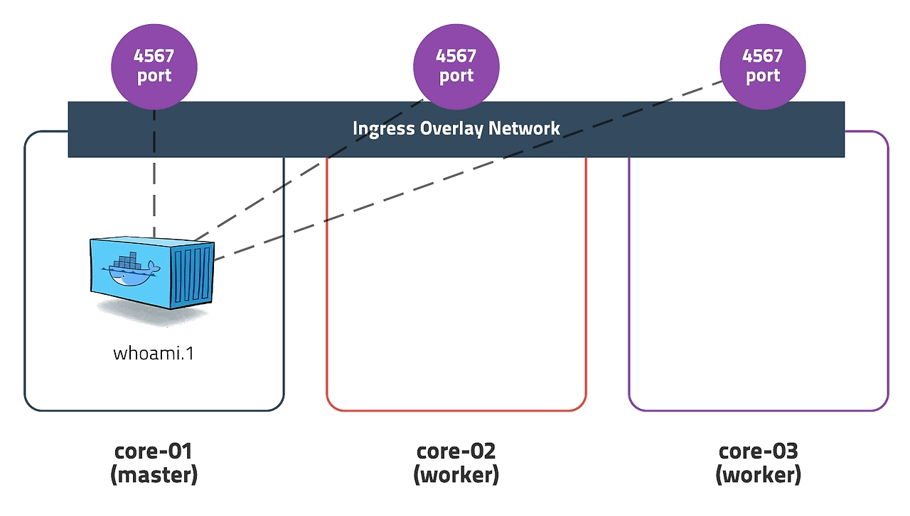
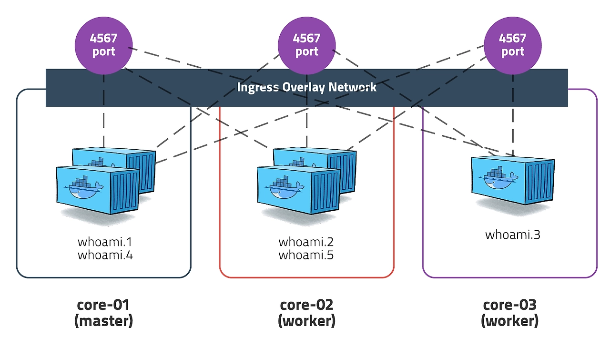
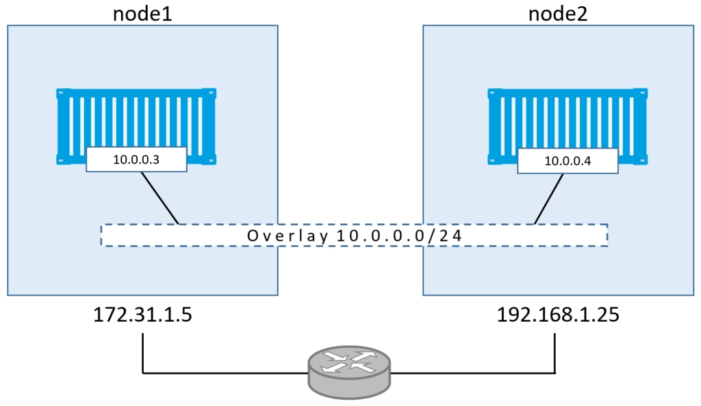

# Ingress Network

스웜 클러스터를 생성하면 자동으로 생성되는 네트워크이다.

서비스의 노드들 간에 로드 밸런싱을 수행하는 Overlay 네트워크이다. Ingress Network는 도커 스웜을 init 하거나 join 할 때 자동으로 생성된다.

도커 스웜에서는 서비스를 외부에 쉽게 노출하기 위해 모든 노드가 ingress라는 가상 네트워크에 속해있다.

**각 노드(서버)에 내장되어 있는 로드 밸런서를 통해 서비스 내의 컨테이너들 간에 라운드 로빈(round-robin) 방식으로 로드 밸런싱을 수행**한다. 이 로드 밸런서에는 **routing mesh** 라는 기능이 있는데, 이는 **노드에 실행중인 서비스가 없더라도 Ingress Network에서 실행되고 있는 모든 서비스에 대한 포트를 오픈해 각 노드의 로드 밸런서를 모든 컨테이너와 연결시켜주는 기능**이다.

https://yoo11052.tistory.com/184

위 이미지를 보면 node3에는 컨테이너가 없지만 node3의 로드 밸런서가 다른 모든 노드의 컨테이너와 연결되어 있다.

서비스를 생성할 때 연결할 포트를 지정해주는데, 이는 실제로 **컨테이너가 해당 호스트의 포트와 연결되는 것이 아니라 해당 호스트의 포트에 들어온 요청을 서비스 내의 컨테이너 중 1개로 리다이렉트 해주는 것**이다.

https://yoo11052.tistory.com/184

클러스터 내 3개의 노드가 존재하고, 서비스가 하나의 노드에만 컨테이너가 실행되고 있는 경우, 나머지 두 노드에 컨테이너가 실행되고 있지 않아도 두 노드에 요청이 들어오면 Ingress Network가 알아서 컨테이너가 실행되고 있는 노드로 요청을 리다이렉트 한다.

https://yoo11052.tistory.com/184

반대로 서비스를 스케일 아웃해 하나의 서비스에 여러 개의 컨테이너가 실행되고 있는 경우에는 어떻게 될까?

각각은 독립된 컨테이너고, Ingress Network가 알아서 각각의 컨테이너로 요청을 부하 분산 처리하기 때문에 몇 개의 노드에 몇 개의 컨테이너가 실행되고 있는지는 별로 중요하지 않다.

# Overlay Network

예를 들어 2개의 컨테이너가 있는데, 컨테이너A가 DB컨테이너에 접속해야 한다면, 둘 다 ingress 네트워크에 배치해 외부에 노출된 상태로 통신하는 것은 좋지 않다. 즉, **컨테이너간 통신을 위한 네트워크**가 필요하다. 외부에서 접근하지 못하는 내부 컨테이너 간의 네트워크에 컨테이너를 배치한다.

네트워크 안에 있는 여러 개의 도커 데몬(도커 호스트 또는 노드)간의 통신을 관리하는 가상의 네트워크이다. 컨테이너는 Overlay Network의 서브넷에 해당하는 IP 대역을 할당받고 이 IP를 통해 서로 **내부적으로 통신**하게 된다.

https://yoo11052.tistory.com/184

Docker Swarm에 참여하는 도커 데몬간의 통신을 관리한다. 또한, 생성한 오버레이 네트워크에 Swarm Service를 연결시켜 Service 간에 통신을 활성화할 수 있다. 이러한 오버레이 네트워크는 Overlay Network Driver를 사용한다.

오버레이 네트워크를 사용하면 컨테이너는 외부에 포트를 오픈하지 않아도 되고 연결되는 다른 컨테이너와 다른 노드에 있어도 같은 서버에 있는 것처럼 통신할 수 있다. 이를 통해 Overlay Network에 속해있는 모든 컨테이너들은 서로 다른 도커 호스트에 있는 컨테이너와 마치 같은 서버에 있는 것처럼 통신할 수 있다.

# 참고 자료

- https://yoo11052.tistory.com/184
- https://watch-n-learn.tistory.com/49
- https://bes99.tistory.com/37